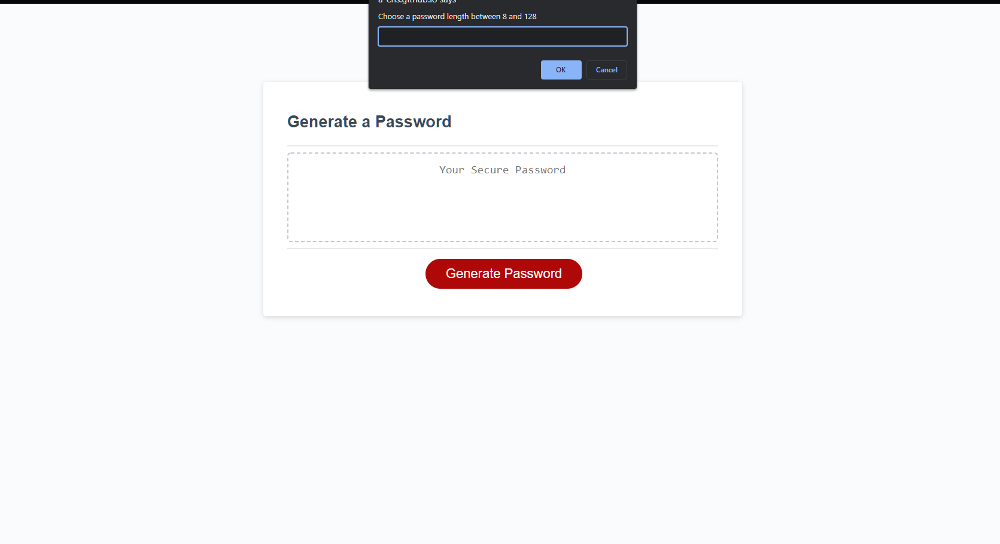

# JavaScript Password Generator

## Description
This application generates a distinct password everytime the user clicks the button. This is useful to a lot of people, given the proliferation of password-requiring sites throughout the web nowadays. 

In the course of making this site, I initially tried to use unicode numbers to represent each of the types of characters. I abandoned that approach after finding it difficult. Ultimately, while it was many more keystrokes, I found listing all of the characters out to be easier. 

In the future, this project could be improved by adding html checkboxes for each Yes/No condition and a text box to enter the number of characters. It could also use some css improvements--it's not the prettiest site to look at.

## How to use the project
Users begin by pressing the button. They are then asked to choose a password length between 8 and 128 characters. Thereafter, they are given a series of Yes/No questions about whether they would like to include lowercase letters, uppercase letters, symbols, numbers. Based on their answers, a password is generated with the criteria they selected.

## License
This application is totally free for anyone to use. 

## Demo of the site
